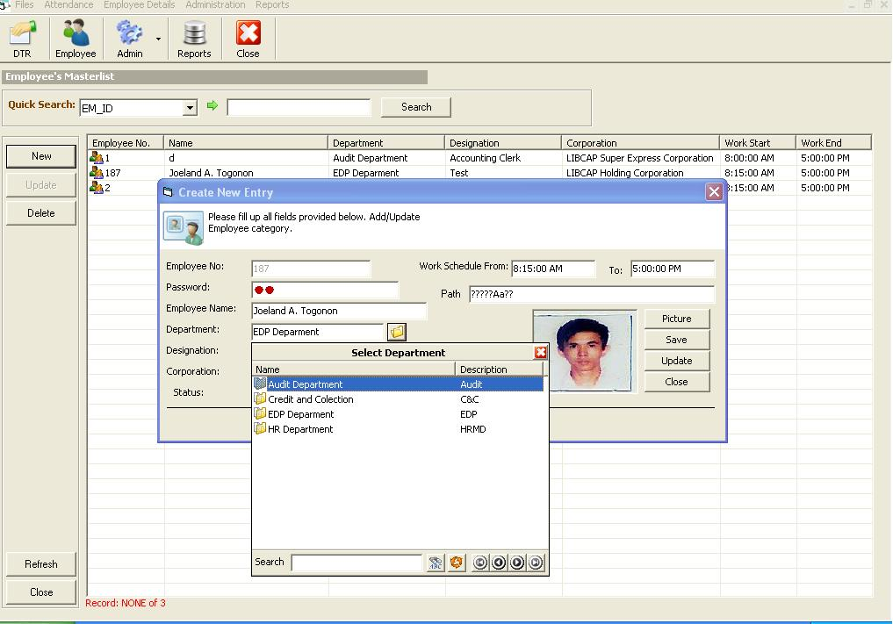



## Daily Time Record System

### Description

Description:

- A computerize Daily Time Record System

- A Daily Time-in & Time-out of Employee

- Generate daily,weekly, and monthly report

to all programmer of this site thank you,,

also thanks TOXIOD's..
 
### More Info
 

             |
---                |---
**Submitted On**   |2011-05-05 05:48:48
**By**             |[Joeland A\. Togonon](https://github.com/Planet-Source-Code/PSCIndex/blob/master/ByAuthor/joeland-a-togonon.md)
**Level**          |Beginner
**User Rating**    |3.7 (11 globes from 3 users)
**Compatibility**  |VB 6\.0
**Category**       |[Complete Applications](https://github.com/Planet-Source-Code/PSCIndex/blob/master/ByCategory/complete-applications__1-27.md)
**World**          |[Visual Basic](https://github.com/Planet-Source-Code/PSCIndex/blob/master/ByWorld/visual-basic.md)
**Archive File**   |[Daily\_Time220357572011\.zip](https://github.com/Planet-Source-Code/joeland-a-togonon-daily-time-record-system__1-73897/archive/master.zip)

